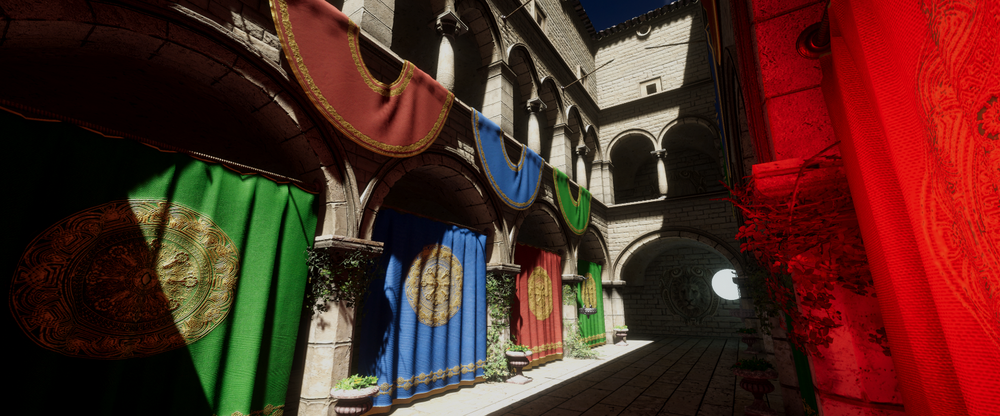

# RTX Global Illumination in Unity

## Introduction

This respository is [RTXGI-DDGI](https://github.com/NVIDIAGameWorks/RTXGI-DDGI?tab=readme-ov-file) implementation in Unity 2022.3.17f1c1 with URP14.0.9

It use Microsoft DirectX Raytracing to trace ray from each probe to scene geometry, grab irradiance and evaluate into texture

## System Requirements

This renderer feature need DXR capable GPU, and you need to enable DirectX12 Graphics API on Windows in unity

## Limitations

This is more like a demostration, we have some limitations here.

- Only DirectX12 API is supported on Windows

- Only one probe volume supported, and you can`t rotate it
- Probe Classification is not supported
- We use FindObjectsOfType to grab scene lights in each frame, it may be expensive
- Transparent object is not tested at this version

- **Only Tested on NVIDIA Cards (NVIDIA Geforce 4070 Ti)**

## Third Party

- [LWGUI](https://github.com/JasonMa0012/LWGUI)
- [Unity Sponza](https://github.com/Unity-Technologies/Classic-Sponza)

## Reference

- [NVIDIA-RTXGI-DDGI](https://github.com/NVIDIAGameWorks/RTXGI-DDGI?tab=readme-ov-file)
- [Adria-DX12](https://github.com/mateeeeeee/Adria-DX12)
